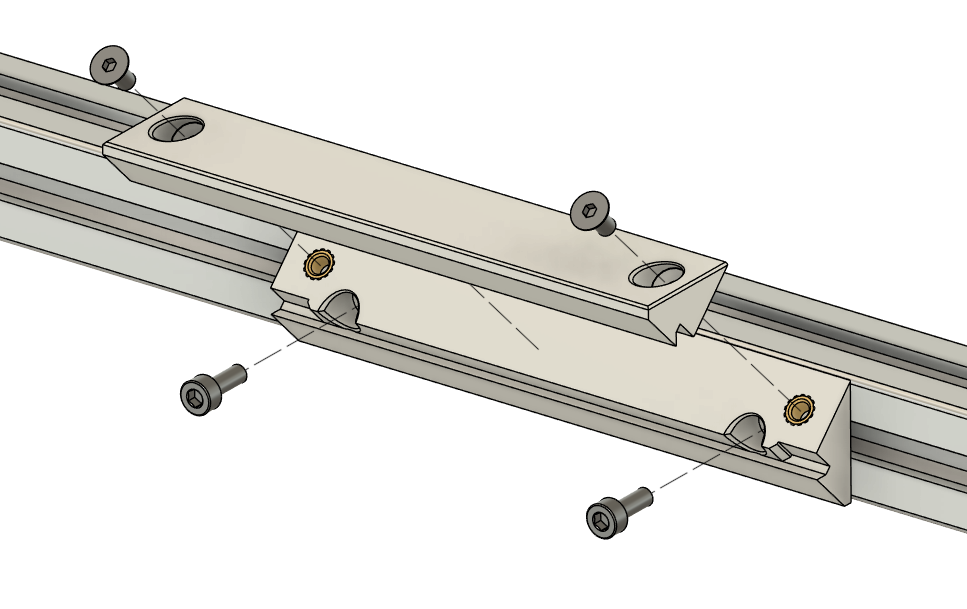

# COB Light Strip Mount
This is an easy and fast to print mount for COB (chip on the board) LED strips, which are included in LDO Voron kits starting from Rev.D. These LED strips have built-in light diffusion which produces a softer lighting effect for your printer. 
- The STLs come in three sizes (50/100/150mm) that allow you to combine into different lengths to match your LED strip. 
- The provided Fusion 360 source file is parametric to allow for any arbitrary length for the mount. 

## Printing for LDO kits
The following are recommend print counts for different LDO Voron kits. Note that you can always substitude 50mm variant and 100mm variant with a single 150mm variant.

### Voron 2.4-300 Kit
Print 6x cob_light_strip_mount_100mm 

### Voron 2.4-350 Kit
Print 6x cob_light_strip_mount_100mm + 2x cob_light_strip_mount_50mm

### Voron Trident-250 Kit
Print 6x cob_light_strip_mount_100mm + 2x cob_light_strip_mount_50mm

### Voron Trident-300 Kit
Print 8x cob_light_strip_mount_100mm

## Assembly
Each mount is a two piece assembly (for easy printing). Use 2x M3 Heatsets and 2x M3x6 FHCS screws two assemble the two pieces together. Use 2x M3x8 SHCS to install the part to the side of a 2020 extrusion.

