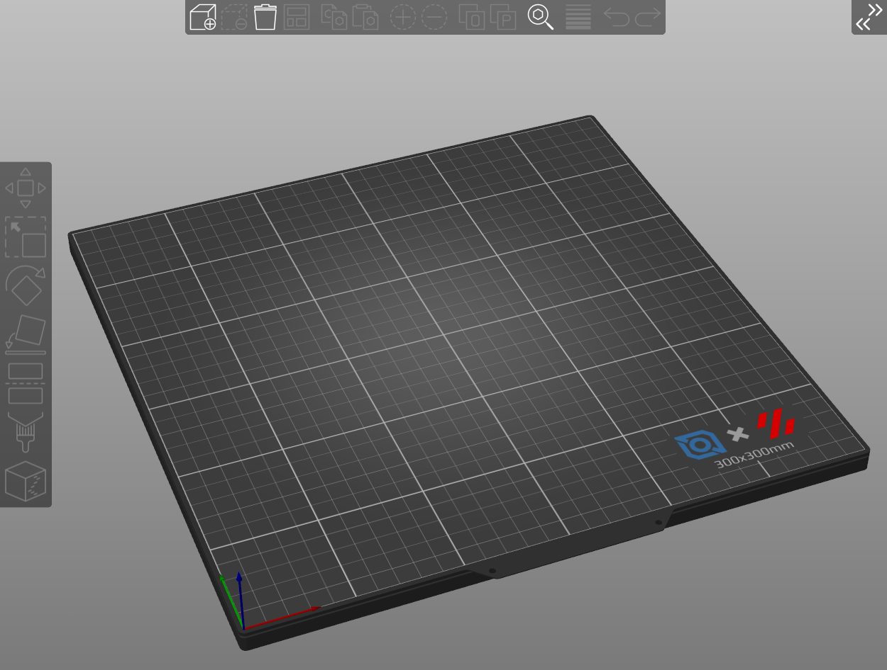

# Slicer Plate Models & Textures
This folder contains models and textures that can be used in SuperSlicer or PrusaSlicer. Open Printer Settings->General->Bed Shape. 
- Under Texture, select the svg file appropriate to your build plate size ("300_ldo_texture.svg" for a 300mm plate)
- Under Model, select the stl file appropriate to your build plate size ("Voron_300_Build_Plate.stl" for a 300mm plate)

